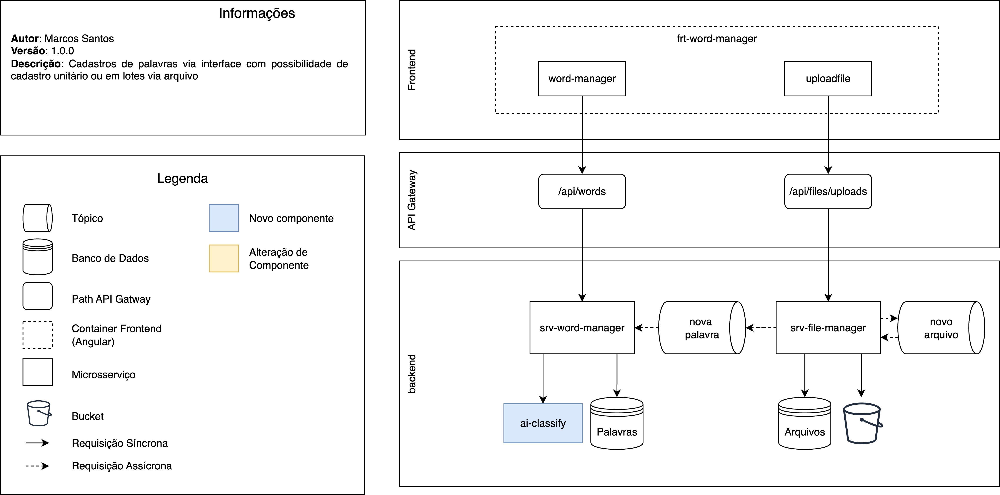
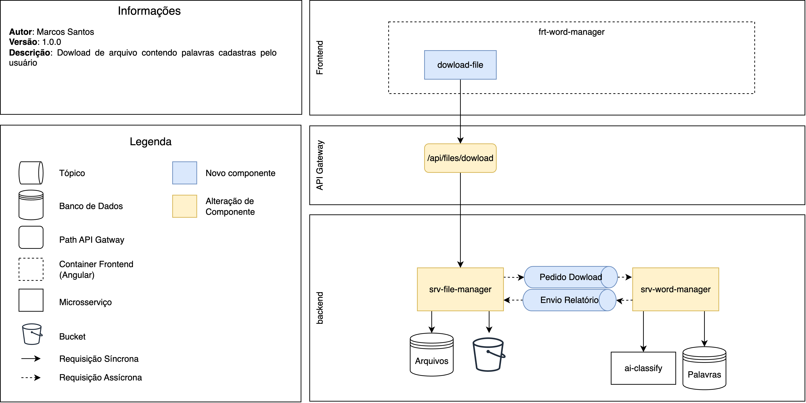

# Count Word

Aplicação web para cadastro e contagem de palavras em inglês, permitindo registrar usos, acompanhar métricas por usuário e visualizar estatísticas por nível (A1–C2).

O projeto já conta com cerca de **5 mil palavras do dicionário de Oxford**, que representam as palavras mais usadas na língua inglesa.


## Arquitetura

A seguir estão dois diagramas que exemplificam como os compenentes se conectam na solução.


### Diagrama de Cadastro de uma palavra



### Diagrama de dowload das palavras cadastradas pelo usuário



## 🚀 Stack utilizada

As tecnologias usadas foram escolhidas pensando em opções open source, seguras e escaláveis, que pudessem ser containerizadas, de forma que não seja necessário instalar nada além do Docker, promovendo uma melhor experiência para o desenvolvimento (DevEx), além de incentivar o aprendizado com tecnologias amplamente adotadas pelo mercado.

* **Frontend:** Angular 17+ (standalone components, `HttpClient`, **proxy** para `/api`).
* **Backends:** Spring Boot 3.5 (microsserviços `word-manager` e `file-manager`).
* **Auth:** Keycloak (OpenID Connect / JWT).
* **Banco:** MySQL 8 (migrações **Flyway**).
* **Mensageria/Eventos:** **Apache Kafka** (com **Kafka UI**).
* **Objetos/Uploads:** **MinIO** (S3 compatível).
* **Gateway (dev):** **Kong** + **Konga** (UI).
* **Containerização:** Docker Compose (serviços de backend, banco, Keycloak, Kafka, MinIO). O **frontend não é containerizado** (roda com `ng serve`).

## ▶️ Como iniciar o projeto

Na raiz do repositório:

```bash
chmod +x start-project.sh
./start-project.sh
```

O script faz:

1. Sobe os containers definidos em `infrastructure/docker/docker-compose.yml`.
2. Configura o **Keycloak** automaticamente (desabilita SSL obrigatório, ajusta `frontendUrl`).
3. **Garante os tópicos do Kafka**:

   * `minio-events` (para integrações via MinIO → Kafka, caso habilitadas).
   * `cw.file.stored` e `cw.word.detected` (**retenção de 12h = `retention.ms=43200000`**, `cleanup.policy=delete`).
4. Prepara o **MinIO** (cria o bucket `countword` se não existir).
5. Aguarda o backend em `:8080`.
6. Inicia o **frontend Angular** em `http://localhost:4200` com `proxy.conf.json`.

> Observação: o script **cria/ajusta** os tópicos de domínio e suas políticas de retenção.
> Se seu cluster Kafka não tiver auto-criação de tópicos, o script também **cria** os tópicos idempotentemente.

## 🔌 Serviços & portas (padrões)

| Serviço            | URL / Porta             | Observações                                |
| ------------------ | ----------------------- | ------------------------------------------ |
| Frontend (Angular) | `http://localhost:4200` | `ng serve` com proxy para `/api`           |
| Backend (API)      | `http://localhost:8080` | `word-manager`                             |
| File Manager       | `http://localhost:8082` | Processamento de arquivos                  |
| Keycloak (Console) | `http://localhost:8081` | Admin: `admin` / `admin`                   |
| MinIO API          | `http://localhost:9000` | AccessKey: `admin` / SecretKey: `admin123` |
| MinIO Console      | `http://localhost:9001` | UI do MinIO                                |
| Kafka (interno)    | `kafka:9092`            | Para apps **dentro** da rede Docker        |
| Kafka (externo)    | `localhost:9094`        | Para apps **fora** do Docker               |
| Kafka UI           | `http://localhost:8085` | Visualização de tópicos/consumidores       |
| Kong (Proxy)       | `http://localhost:8000` | Gateway (dev)                              |
| Kong (Admin)       | `http://localhost:8001` | Administração do Kong                      |
| MySQL              | `localhost:3306`        | DB: `english` / user: `app` / pass: `app`  |

## 🧵 Tópicos Kafka usados

* **Domínio (criados pelo script, com retenção de 12h):**

  * `cw.file.stored`
  * `cw.word.detected`
* **Infra (opcional, para eventos do MinIO):**

  * `minio-events` (criado se não existir; retenção padrão do cluster)

> **Importante:** mensagens **não são removidas ao consumir**; expiram pela política de retenção (tempo/tamanho).
> Em dev, 12h costuma ser suficiente para reprocessos e depuração.

## 📂 Estrutura (alto nível)

* `infrastructure/docker/` → `docker-compose.yml` (db, keycloak, kafka, minio, kong, backends, kafka-ui)
* `frontend/` → Angular app (rodando com `ng serve`)
* `backend/word-manager/` → API principal (Spring Boot)
* `backend/file-manager/` → processamento de arquivos (Spring Boot)
* `start-project.sh` → script de inicialização/orquestração

## 🛠️ Dicas de desenvolvimento

* **Kafka nos microsserviços (dentro do Docker):** use `kafka:9092` (não `localhost:9092`).
  Ex.: `SPRING_KAFKA_BOOTSTRAP_SERVERS=kafka:9092`.
* **Angular → Backend:** `proxy.conf.json` redireciona `/api` para `http://localhost:8080`.
* **MinIO:** bucket padrão `countword`. Para acessar a UI: `http://localhost:9001` (admin/admin123).

## 🔮 Próximos passos

* Integrar **Kong** como API Gateway (autN/autZ, rate limit, roteamento).
* Implementar **upload de arquivos**.
* Suportar **digitação/análise de textos maiores**.

---

👤 Projeto desenvolvido para estudo de arquitetura e prática com **Keycloak**, **Angular**, **Spring Boot**, **Kafka** e **MinIO**.
