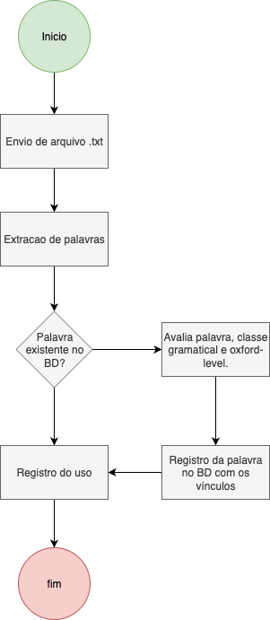

# Processo 01 – Upload e Registro de Palavras

- **Status:** ✅ Implementado  
- **Última atualização:** 2025-09-07  

---

## Objetivo
Permitir que o usuário envie um arquivo `.txt` com palavras em inglês para que sejam extraídas, avaliadas e registradas no sistema.

## Atores
- **Usuário autenticado**: envia o arquivo.  
- **Sistema**: processa, valida e registra palavras/usos.  

## Fluxo Resumido
1. Usuário envia um arquivo `.txt`.  
2. O sistema realiza a **extração de palavras**.  
3. Para cada palavra:
   - Se já existe no BD → registra apenas o uso.  
   - Se não existe → avalia classe gramatical e nível (Oxford), registra no BD e vincula ao usuário.  
4. Fim do processo.  

## Diagrama

