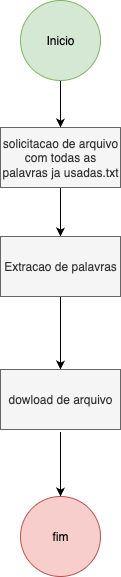

# Processo 02 – Download de Palavras Usadas

- **Status:** ❌ Não iniciado  
---

## Objetivo
Permitir que o usuário gere um arquivo `.txt` contendo todas as palavras que já utilizou no sistema.

## Atores
- **Usuário autenticado**: solicita o arquivo.  
- **Sistema**: compila e retorna a lista.  

## Fluxo Resumido
1. Usuário solicita um arquivo com as palavras já usadas.  
2. O sistema extrai do BD todas as palavras distintas do usuário.  
3. Gera o `.txt`.  
4. Usuário realiza o download.  

## Diagrama

