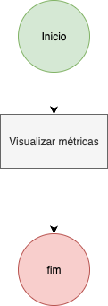

# Processo 03 – Visualização de Métricas

- **Status:** ❌ Não iniciado  
---

## Objetivo
Permitir que o usuário visualize estatísticas de uso das palavras, agrupadas por nível de proficiência (A1–C2).

## Atores
- **Usuário autenticado**: acessa a tela de métricas.  
- **Sistema**: calcula e exibe estatísticas.  

## Fluxo Resumido
1. Usuário acessa a página de métricas.  
2. O sistema consulta o BD e agrupa por `oxford_level`.  
3. Exibe:
   - Quantidade de palavras distintas usadas por nível.  
   - Primeiro e último uso registrado.  

## Diagrama

